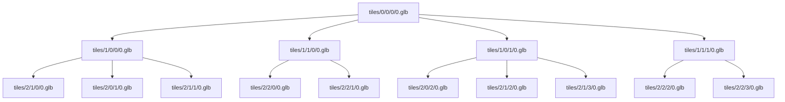

# ifc_kievitsweg

3D Tiles from model https://github.com/Geonovum/GeoBIM_Georefereren/blob/main/data/Kievitsweg_R25_ILS%20Spaces%2020250815_LoGeoRef.ifc

1] Ion

https://bertt.github.io/ifc_kievitsweg/ion

Indeling:



2] Py3dtiles

command:

```bash
py3dtiles convert kievitsweg.ifc
```

Issue: something with crs

Demo: https://bertt.github.io/ifc_kievitsweg/py3dtiles/


